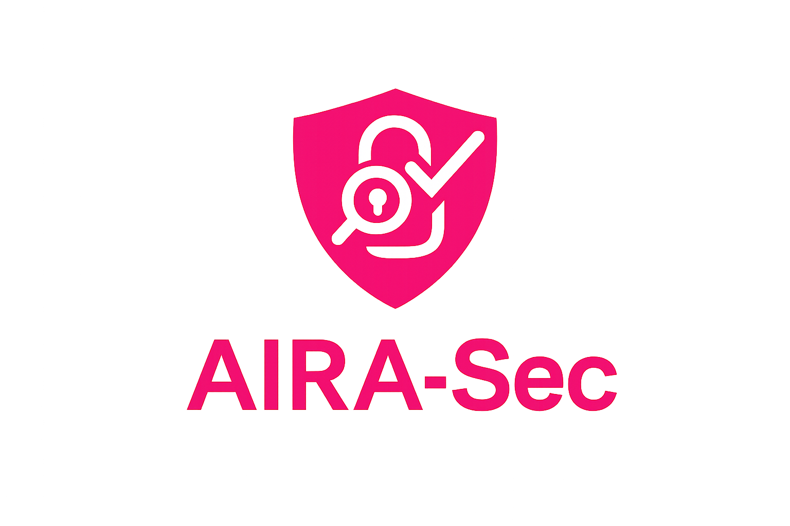
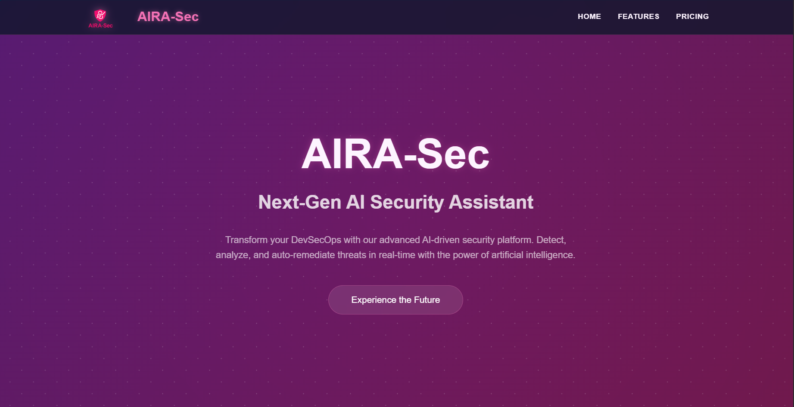
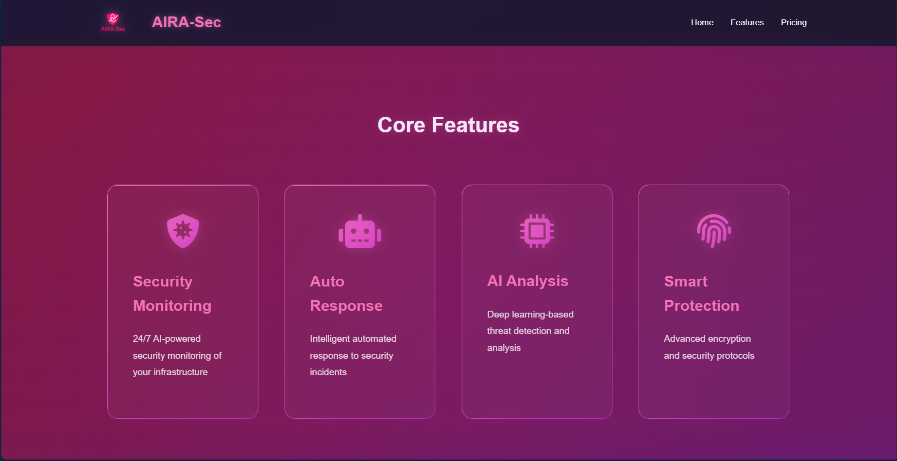
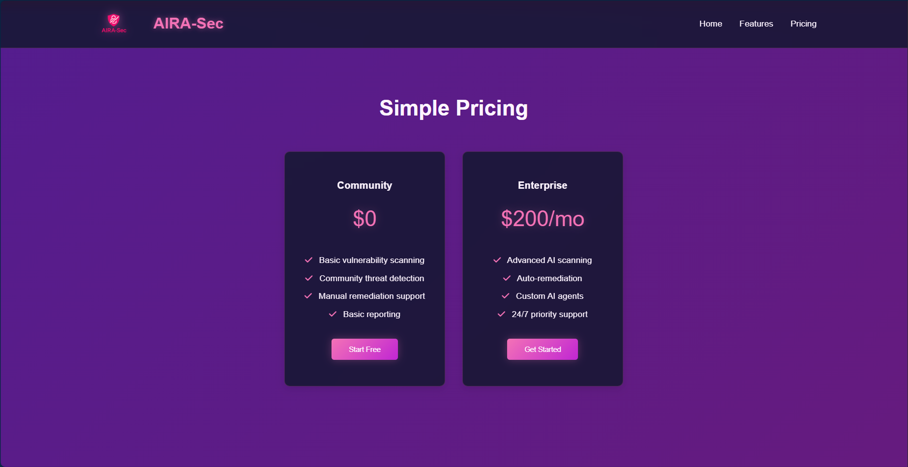

# AIRA-Sec: AI-Powered DevSecOps Assistant

<div align="center">
  
  <h3>Securing the future with AI</h3>
</div>

## Overview

AIRA-Sec is an advanced AI-driven security platform that enhances your DevSecOps workflow with intelligent monitoring, automated response, and proactive threat detection.

## 🌟 Live Demo Screenshots

### Landing Page

*AI-powered security platform with modern interface*

### Core Features

*Comprehensive security features powered by artificial intelligence*

### Pricing Plans

*Flexible pricing options for every organization*

## 🚀 Key Features

- 🛡️ **24/7 Security Monitoring**
  - AI-powered infrastructure monitoring
  - Real-time threat detection
  - Continuous security assessment

- 🤖 **Intelligent Auto Response**
  - Automated incident handling
  - Smart threat mitigation
  - Rapid security enforcement

- 🧠 **AI Analysis Engine**
  - Deep learning-based detection
  - Pattern recognition
  - Predictive threat analysis

- 🔐 **Advanced Protection**
  - Enterprise-grade encryption
  - Multi-layer security protocols
  - Compliance-ready controls

## 💻 Technology Stack

- HTML5
- CSS3 with Modern Features:
  - Glassmorphism
  - CSS Grid/Flexbox
  - Smooth Animations
  - Responsive Design
- Vanilla JavaScript
- FontAwesome Icons

## 🛠️ Quick Start

1. Clone the repository
```bash
git clone https://github.com/yourusername/AIRA-sec.git
```

2. Open the project
```bash
cd AIRA-sec
```

3. Launch the application
- Open `index.html` in your browser
- No build process required
- Pure HTML/CSS/JS implementation

## 💎 Design Features

- Modern Glassmorphism UI
- Responsive Layout
- Smooth Scroll Animations
- Interactive Elements
- Space-themed Color Scheme
- Dynamic Card Layouts

## 🤝 Contributing

1. Fork the repository
2. Create your feature branch (`git checkout -b feature/AmazingFeature`)
3. Commit your changes (`git commit -m 'Add some AmazingFeature'`)
4. Push to the branch (`git push origin feature/AmazingFeature`)
5. Open a Pull Request

## 📝 License

This project is licensed under the MIT License - see the [LICENSE](LICENSE) file for details

---

<div align="center">
  <p>© 2025 AIRA-Sec. All rights reserved.</p>
  <p>
    <a href="#overview">Overview</a> •
    <a href="#features">Features</a> •
    <a href="#quick-start">Quick Start</a> •
    <a href="#contributing">Contributing</a>
  </p>
</div>